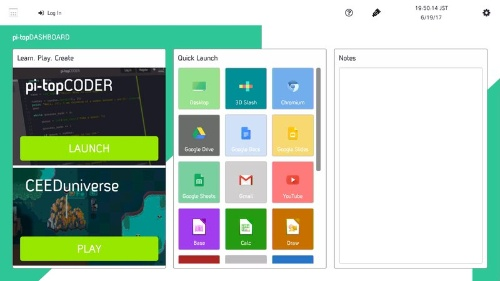
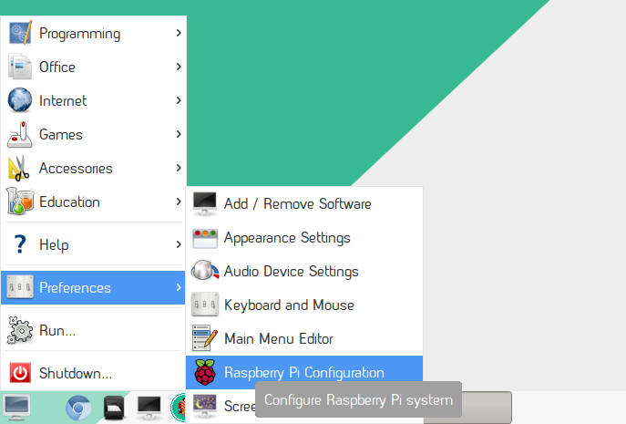

**CO.LAB**

**Empowered by Red Hat**

The goal of CO.LAB is to introduce young people to the principles of
open source -- and to a world of technology and collaboration that they
may not have otherwise considered. Collaboration is a powerful driver of
innovation and discovery, and open source methodology is a key part of
STEAM (science, technology, engineering, arts, and mathematics)
education. Empower your young people with collaborative skills that will
help them succeed in their pursuit of science, technology, engineering
and math careers.

**WHAT YOU’LL
NEED**

| **PARTS**                                                       | **MODEL**                                                                              | **QTY** | **EST COST** | **SOURCE**                              |
| --------------------------------------------------------------- | -------------------------------------------------------------------------------------- | ------- | ------------ | --------------------------------------- |
| PiTop Ceed                                                      |                                                                                        | 1       | $115.00      | Pi-Top                                  |
| Raspberry Pi                                                    | Pi 3 Model B                                                                           | 1       | $40.00       | Adafruit, Amazon, multiple distributors |
| Camera board                                                    | Pi Camera board - 8 megapixel V2.1 (product ID 3099)                                   | 1       | $30.00       | Adafruit, Amazon                        |
| Touchscreen                                                     | Adafruit 2423 capacitive touchscreen - Model B+/Pi2                                    | 1       | $45.00       | Adafruit                                |
| Battery pack                                                    | Ramoss USB Battery pack - 4000mAh - 5V @1A                                             | 1       | $24.50       | Adafruit                                |
| Keyboard and Mouse                                              | ProHT USB Optical Mouse/ Keyboard combo (70126)                                        | 1       | $10.39       | Amazon                                  |
| Micro SD card                                                   | SanDisk 16GB Mobile MicroSDHC Class 4 Flash Memory Card With Adapter- SDSDQM-016G-B35A | 1       | $7.00        | Amazon                                  |
| **OPTIONAL ITEMS (good to have just in case)**                  |                                                                                        |         |              |
| Ethernet cables                                                 |                                                                                        |         |              |                                         |
| HDMI cables                                                     |                                                                                        |         |              |                                         |
| HDMI-enabled monitors for displaying curriculum on large screen |                                                                                        |         |              |                                         |
| Surge protectors                                                |                                                                                        |         |              |                                         |
| Raspberry Pi case                                               |                                                                                        |         |              |                                         |

THE CURRICULUM: OVERVIEW

2-3 day event

Broken down into 3 main sections -- Learn. Create. Share.

LEARN

Students are tutored on basic documentary photography and storytelling
techniques, as well as introduced to the themes of interconnectedness
and community. After that, they’re taught to build, program and operate
their Raspberry Pi digital camera kits.

\<Basic documentary\>

\<Storytelling\>

\<Raspberry Pi build\>

CREATE

Day two will bring our students a more specific educational focus on
artistic flair and Raspberry Pi photography guidelines. Then they’ll
depart on their journey through Boston neighborhoods – finding
inspiration, shooting photos, and forming stories.

SHARE

On their last day, all 25 girls will return to City Hall Plaza, where
they’ll cull and curate the photos they took on day two. This is where
our student teams will work together to create installations that tell
the story of their overall experience. They’ll then share, critique, and
refine — in preparation to bring their project to the public.

**DAY ONE: LEARN (Coding Activity)**

1.  > **Setup the Pi-Top CEED**

<!-- end list -->

1.  > First you need to attach the camera board to the Raspberry Pi. We
    > need to do this first because the Raspberry Pi will sit inside of
    > the CEED monitor so you will not be able to move the Pi around
    > when your monitor is on.
    
    1.  > The port is marked CAMERA, and it is beside the HDMI port. It
        > will have a small plastic covering on it. Peel off this
        > covering.
    
    2.  > You open the camera slot by lifting from the two short edges.
        > You will feel the black plastic piece come up.
    
    3.  > Insert the camera cable with the blue tab facing the right
        > side of the CEED (toward the ethernet port).
    
    4.  > Press the black plastic on the camera port back down until you
        > feel it snap tight.

2.  > Remove the black plastic panel from the bottom of the Pi Top CEED,
    > by sliding it to the side. This is where we will put the Raspberry
    > Pi.

3.  > Insert the (preformatted) Pi Top CEED SD card into the Raspberry
    > Pi. This SD card should be found in the CEED box. The SD card slot
    > is located on the bottom of the Raspberry Pi.

4.  > Attach the 4 magnets (found inside the CEED box) in the mounting
    > holes on the Raspberry Pi, then attach to the silver bars inside
    > the CEED. This keeps the Pi attached inside the CEED.

5.  > Attach the long black bar cable with the red wire towards the SD
    > card side.

6.  > Attach the HDMI cable to the bottom HDMI port of the Raspberry Pi.

7.  > Attach a keyboard and a mouse to the USB ports on the side of the
    > Raspberry Pi. These should be accessible from the right side of
    > the CEED.

8.  > Insert the power cord in the left side of the CEED.

9.  > Leave the black sliding front off the CEED.

10. > Once students plug the Pi-Top CEED into an outlet, press the power
    > button on the left side for 2-3 seconds to power on. A colorful
    > square will appear, followed by the boot-up text. A “Get Started”
    > screen will appear.

11. > Follow the on-screen instructions, connecting to WiFi when it
    > prompts you to do so (these are UK defaults, so we’ll need to
    > change them).

**2. Enable Camera on CEED **

1.  > When you start the CEED, you will see an interface that looks like
    > this:  
    >   
    >   
    > Scroll down in the “Quick Launch” section in the middle, and
    > you’ll see a button named “Python 3.” That’s what we’re going to
    > be using later, so click it now.

2.  > Once you click it, you’ll see the Python window on a more
    > familiar-looking desktop. Before you can start writing code for
    > the camera, you’ll need to enable the camera. Click the terminal
    > icon in the lower left corner, then Preferences \> Raspberry Pi
    > Configuration:  
    > 

3.  > In the Raspberry Pi Configuration window, click the Interfaces
    > tab. Select Enable by Camera, and click OK.  
    > 

4.  > You will be prompted to reboot the CEED. Click OK. Once the system
    > reboots, you will be ready to try some Python code for the camera.

**3. Learn to use the Pi Camera on the CEED (30 min): **

> You can use the following instructions to:

  - > Write a basic script for taking a photo with a 5-second delay

  - > Try out a live feed

> **  
> **We will go through these steps as a group, but if you have a student
> going more quickly or slowly, feel free to help them move along at
> their own pace using these instructions.
> 
> First, click the same Python 3 button you found before we enabled the
> camera. Click it to open the Python 3 IDLE.
> 
> *Write a basic script for taking a photo*

1.  > Click File \> New File. Save this file as camera.py.

2.  > Write the script below to try out your Pi camera and put a live
    > feed on your monitor for 10 seconds. You will see some of the text
    > change colors as you’re typing. That’s OK. Be sure to type EXACTLY
    > what you see below.

> from picamera import PiCamera  
> from time import sleep  
> camera = PiCamera()  
> camera.start\_preview()  
> sleep(10)  
> camera.stop\_preview()

3.  > When you’ve written this, save your file by pressing Ctrl + S.

4.  > Press F5 to run your script. You should see the camera preview for
    > 10 seconds and then close. You can move the camera around during
    > this time. NOTE: CTRL + D should stop the live feed if you get
    > stuck in it (this tends to happen, don’t worry).  
    >   
    > If you do not see the camera preview, there is an error in your
    > script. Be sure that you typed it exactly as you see above.

5.  > Now that we have taken a 10 second live feed, let’s take a
    > picture\!
    
    1.  > To take a real picture, you need to amend your code. You can
        > use the same camera.py file. Adjust the sleep() to be 5
        > seconds: this means the camera will wait for 5 seconds before
        > taking the photo. You also need to add a new line of code to
        > capture the photo, and you need to name your photo and give it
        > a file path on your Desktop. Add this line after sleep(5):  
        >   
        > camera.capture('/home/pi/Desktop/image.jpg')

6.  > Ctrl + S to save, and press F5 to run it again. You should see the
    > camera preview for 5 seconds before it takes a photo.

7.  > Your photo will be saved to the desktop. You can double-click it
    > to open it. You can take more pictures using this script and
    > changing ‘/image.jpg’ to a new file name and running the script
    > again.

*Try out a live feed*

1.  > The Pi camera also does video. To start, delete the last three
    > lines of your file. It should now end with
    > camera.start\_preview().

2.  > Add these three lines to replace them:  
    > camera.start\_recording('/home/pi/video.h264')  
    > sleep(10)  
    > camera.stop\_recording()  
    > camera.stop\_preview()

3.  > Ctrl + S to save, and press F5 to run the code. It will record ten
    > seconds of video and then close. If it doesn’t, double check your
    > typing.

4.  > We’ll use the command line to play the video. Click the Terminal
    > button in the taskbar:  
    > 

5.  > Type omxplayer video.h264 in the terminal and press Enter. The
    > video should open and play. It may be at a faster speed than you
    > expected.

**Summary**

At this point we have:

  - > Setup the Pi Camera

  - > Tried out a live feed

  - > Taken photos with a 5 second delay

  - > Take a short video

> NOTE: You can decide if there are other things you want to introduce
> the students to with the Pi Camera. The kids can extend the code to do
> things like:

  - > Add cool effects to the photos

  - > Adjust brightness when taking photo

  - > Take multiple photos in a row

> *Instructions based on project at:
> [https://projects.raspberrypi.org/en/projects/getting-started-with-picamera](https://projects.raspberrypi.org/en/projects/getting-started-with-picamera)*

**Assemble Portable Pi Camera**

Students obtain their Raspberry Pi (3) and touchscreen, battery, case,
SD card, etc., they assemble and turn them on for the first time. (NOTE:
We provided a second Raspberry Pi, but reused the Camera. If you use two
camera modules per student, you can skip step A.)

1.  > Carefully remove the camera cable from the Raspberry Pi in the
    > CEED. Lift the black plastic piece on the camera port and remove
    > the cable.

2.  > Insert the camera into the new Raspberry Pi just as you placed it
    > in the CEED. Remember, the blue strip faces the ethernet and USB
    > ports.

3.  > Attach the TFT touchscreen onto the GPIO pins. Pay close attention
    > so that you do not bend the pins\!

4.  > Insert the SD card with the Camera software image

5.  > Insert the Pi into the plastic case; leave the lid off.

6.  > Plug into battery pack into both ends (USB into the power pack,
    > microUSB into the Pi). Press the power button on the battery pack.
    > Rubber band the battery pack around the camera case.

7.  > The Pi camera should power on.

8.  > Tape the camera strip to the Pi case to hold the lens in place.

9.  > Insert a USB thumb drive as a way to store the photos.

10. > Test that you can tap the screen on the camera to take a photo.
