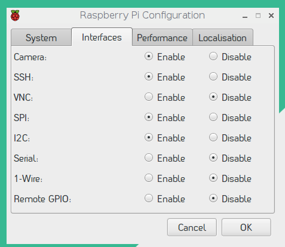
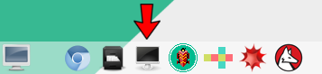

**CO.LAB **

**RASPBERRY PI TUTORIAL**

**\*\*Draft\*\***

Additional
resources

[http://makezine.com/projects/raspberry-pi-point-and-shoot-camera/](http://makezine.com/projects/raspberry-pi-point-and-shoot-camera/)

[https://www.raspberrypi.org/learning/getting-started-with-picamera/worksheet/](https://www.raspberrypi.org/learning/getting-started-with-picamera/worksheet/)

Welcome
packet

[https://docs.google.com/document/d/1wywNEXl\_80StqYa6iqbwt9RYISSMsOTQ5neJOdncPBM/edit](https://docs.google.com/document/d/1wywNEXl_80StqYa6iqbwt9RYISSMsOTQ5neJOdncPBM/edit)

Do it yourself
guide

[https://docs.google.com/document/d/1Ei-lUN3hzNIwjkNxf2xEMIBnevhv9kgCc6tAyXyNV9s/edit](https://docs.google.com/document/d/1Ei-lUN3hzNIwjkNxf2xEMIBnevhv9kgCc6tAyXyNV9s/edit)

<table>
<thead>
<tr class="header">
<th><strong>PARTS</strong></th>
<th><strong>MODEL</strong></th>
<th><strong>QTY</strong></th>
<th><strong>EST COST</strong></th>
<th><strong>SOURCE</strong></th>
</tr>
</thead>
<tbody>
<tr class="odd">
<td>PiTop Ceed</td>
<td></td>
<td>1</td>
<td>$115.00</td>
<td>Pi-Top</td>
</tr>
<tr class="even">
<td>Raspberry Pi</td>
<td>Pi 3 Model B</td>
<td>2</td>
<td>$40.00/each</td>
<td>Adafruit, Amazon, multiple distributors</td>
</tr>
<tr class="odd">
<td>Camera board</td>
<td>Pi Camera board - 8 megapixel V2.1 (product ID 3099)</td>
<td>1</td>
<td>$30.00</td>
<td>Adafruit, Amazon</td>
</tr>
<tr class="even">
<td>Touchscreen</td>
<td>Adafruit 2423 capacitive touchscreen - Model B+/Pi2</td>
<td>1</td>
<td>$45.00</td>
<td>Adafruit</td>
</tr>
<tr class="odd">
<td>Battery pack</td>
<td>Romoss USB Battery pack - 4000mAh - 5V @1A</td>
<td>1</td>
<td>$24.50</td>
<td>Adafruit</td>
</tr>
<tr class="even">
<td>Keyboard and Mouse</td>
<td>ProHT USB Optical Mouse/ Keyboard combo (70126)</td>
<td>1</td>
<td>$10.39</td>
<td>Amazon</td>
</tr>
<tr class="odd">
<td>Micro SD card</td>
<td><h1 id="sandisk-16gb-mobile-microsdhc-class-4-flash-memory-card-with-adapter--sdsdqm-016g-b35a">SanDisk 16GB Mobile MicroSDHC Class 4 Flash Memory Card With Adapter- SDSDQM-016G-B35A</h1></td>
<td>2</td>
<td>$7.00/ 
each</td>
<td>Amazon</td>
</tr>
<tr class="even">
<td>Pi case/cover</td>
<td><h1 id="for-raspberry-pi-model-b">For Raspberry Pi Model B</h1></td>
<td></td>
<td></td>
<td>Adafruit</td>
</tr>
</tbody>
</table>

**Helpful to have on hand:**

  - > Ethernet cables

  - > HDMI cables

  - > HDMI enabled monitors for displaying on larger screen

  - > Surge protectors

  - > Case

  - > Masking tape to hold camera strip

**To do ahead of time**

1.  > Image the SD cards using the following code:

\<ljkljkl\>

CAN WE HOST THIS ONLINE?

2.  > Charge the battery
pack

### UPDATE BELOW INFORMATION WITH FULL CODING CURIC, OR UPDATE THE ROS DOC WITH THE MATERIALS LIST.

### Set up the Pi-Top CEED

These instructions assume you have your micro SD card inside of your
Raspberry Pi and that it is installed with the Pi-Top OS (link to
directions on how to do this, or put it in the outline).

1.  > Attach the camera board to the Raspberry Pi. We need to do this
    > first because the Raspberry Pi will sit inside of the CEED monitor
    > so you will not be able to move the Pi around when your monitor is
    > on.

2.  > Follow the instructions inside the Pi-Top box to set up the
    > monitor, inserting the Raspberry Pi within it. Use the 4 magnets
    > inside the CEED box to keep the Pi attached inside the CEED.
    
    1.  > Attach a keyboard and a mouse to the USB ports on the side of
        > the Raspberry Pi. These should be accessible from the right
        > side of the Pi.
    
    2.  > Insert the power cord in the back of the CEED.
    
    3.  > It’s ok to leave the black sliding front off the CEED since
        > we’ll insert the SD card back into the Pi after taking
        > pictures.

3.  > Once you plug the Pi-Top CEED into the wall, press the power
    > button on the left side for 2-3 seconds to power on. A “Get
    > Started” screen will appear.
    
    4.  > Follow the on-screen instructions, connecting to WiFi when it
        > prompts you to do so.

**\[Here: Kids learned about using the Terminal and writing basic
commands through the command line, and explored the games and activities
on their CEED.\] \> we should write these out**

### Assemble Camera

1.  > Assemble the camera using Card B:
    
    1.  > Remove the little piece of green protective film covering the
        > camera ribbon slot. Attach the camera board to the Raspberry
        > Pi in the CAMERA slot (pinch into place). The blue strip faces
        > the USB ports.

> 

2.  > Attach the TFT touchscreen onto the GPIO pins. Pay attention to
    > not bending the pins.

3.  > Plug into battery pack.

4.  > The PI camera should power on if Card B was formatted properly.

5.  > Tape the camera strip to the case to hold the lense in place.

<!-- end list -->

2.  > Test that you can tap screen on the camera to take a photo

3.  > Test that you can remove thumbdrive from Raspberry Pi and plug
    > into computer to retrieve files.
    
    6.  > **Let’s add a picture of the final build of the camera.**

**\[BELOW: This was done a bit differently, or done in advance of the
time with the kids.\]**

**Enable Pi Camera**

1.  > Next we need to enable Pi camera and try it out\!
    
    1.  > To enable the camera on the Pi-Top OS, we need to adjust the
        > configuration settings through the Terminal. To access the
        > Terminal, open your Pi-Top Dashboard and scroll to the bottom
        > of the Quick Launch icons.
    
    2.  > In the Terminal, type “sudo raspi-config” and press Enter.
    
    3.  > The Raspberry Pi configuration tool will open. Use the arrows
        > on your keyboard to move down to “Enable Camera” and press
        > Enter. When it asks you if you want the camera enabled, use
        > your keyboard arrows to move to “Yes” and press Enter again.
    
    4.  > 
    
    5.  > You will need to reboot your Pi-Top CEED after this.

**Write your Camera script**

1.  > Go to your Pi Top Dashboard and open Python 3. This is where you
    > will write Python scripts.
    
    1.  > Save your new Python file by going File \> Save As “camera.py”
    
    2.  > Write the script below to try out your Pi camera and put a
        > live feed on your monitor for 10 seconds. You need to write it
        > EXACTLY like it is displayed below. When you’ve written this,
        > save it (CTRL + S) and then run module (F5). The Python Shell
        > will open, and then a live feed from your camera should appear
        > on screen.
    
    3.  > NOTE: CTRL + D should stop the live feed if you get stuck in
        > it (this tends to happen, don’t worry).

> 

3.  > Now that we have taken a 10 second live feed, let’s take a
    > picture\!
    
    1.  > To take a real picture, you need to amend your code. You can
        > use the same camera.py file. Adjust the sleep() to be 5
        > seconds: this means the camera will wait for 5 seconds before
        > taking the photo. You also need to add a new line of code to
        > capture the photo, and you need to name your photo and give it
        > a file path on your Desktop. Add this:

> 

2.  > The photo that you took was saved to your Desktop. You can take
    > more pictures using this script and changing ‘/image.jpg’ to a new
    > file name and running the script again.

<!-- end list -->

4.  > Now we need to adjust the script so that it will name each photo
    > that you take something new, so that you do not have to rename
    > every new file in the camera.py script every time you want to take
    > a photo. To do this, we will create a “random” function using
    > Python’s random library that will name each photo a random string
    > of letters. In the script, we tell each file name to be 4 letters
    > long (look at the script photo - can you figure out which part
    > does that?\!).
    
    1.  > Create a new Python file or rework your existing camera.py
        > file and make it look just like the script below.
    
    2.  > The “filename” is where your photos will be stored. So we will
        > modify this in the next step.
    
    3.  > 

5.  > Now that we can generate a new file name each time we take a
    > picture, we are going to have a lot of pictures. So let’s create a
    > folder where all our photos can live\!
    
    4.  > Create a new folder by going to the folders icon in the top
        > left of the menu bar to open your files. Then go File \>
        > Create New and name your folder “Images”
    
    5.  > Now let’s adjust our script to assign the new folder as the
        > destination for your photos. To do this, go to the filename
        > variable and replace the current destination (desktop) with
        > your folder’s name. In this case it should be:
        > filename=’/images’
    
    6.  > Test it out to make sure your images are going into your
        > folder\! Then celebrate because you’re being so organized.

**Summary**

At this point we have:

  - > Set up the Pi Camera

  - > Tried out a live feed

  - > Taken photos with a 5 second delay

  - > Written a script to rename every photo something random

  - > Created a folder and told our camera to save all pictures there

NOTE: We should decide if there are other things we want to introduce
the students to with the Pi Camera. The kids can extend the code to do
things like:

  - > Take video

  - > Add cool effects to the photos

  - > Adjust brightness when taking photo

  - > Take multiple photos in a row

**Installing the PiTFT touchscreen**

We are going to install a touchscreen that connects to our Raspberry Pi
so that we can use our camera when we are not connected to a monitor.
The touchscreen will allow us to see our desktop and interact with the
Raspberry Pi through a familiar graphical interface.

1.  > We need to download and install Kernel, which is the software that
    > we need for our touch screen for the Raspberry Pi.

2.  > This
    > [documentation](https://learn.adafruit.com/adafruit-pitft-28-inch-resistive-touchscreen-display-raspberry-pi/easy-install)
    > tells you everything you need to do this in great detail.

> NOTE: This takes a really long time (at least 30 minutes to install)
> and has some tricky steps of working within the Terminal . So we might
> need to install the software before working with the students, but
> involve them in the step of plugging in the touch screen.

3.  > Attach the touchscreen to the Pi (pictures and instructions
    > coming)

Here is the [full documentation on using Pi
Camera](https://picamera.readthedocs.io/en/release-1.13/index.html).
