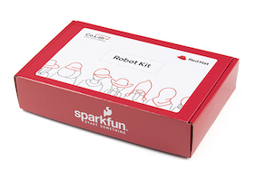

# Build your own robot and become a part of the future of robotics.

## Activity Instructions 
* [Building the Bot and Getting it Running](https://github.com/RedHatOfficial/CO.LAB/blob/master/Robots/Robot%20Activity%201_%20Building%20the%20Bot%20%26%20Getting%20it%20Running.pdf) 
* **New!** [A video to help you with your build](https://youtu.be/-Va7g1q24co)

--> We'll be creating more activities in the coming months, so **watch this space**.

## More about the Red Hat Co.Lab Robot Kit & how to get one
Red Hat Co.Lab has partnered with SparkFun to create an [exciting robot kit](https://www.sparkfun.com/products/16424) that contains everything you need to build your own open source robot that can scroll your name in lights, run a maze and follow a line, and much more. The robot’s brain is a pocket-sized computer called a micro:bit that is packed with functionality, including 25 LEDs, an accelerometer, and a built-in compass. Your robot also comes with three sensors that can measure the amount of light being reflected from the ground, giving your robot a way to “see.”

## Watch the film on Open Source Robotics
After building your robot, check out [Red Hat’s short documentary film](http://www.redhat.com/robots) on one particular robotics project that’s becoming a global phenomenon. This film, part of the Open Source Stories film series, explores how that project’s community members are changing everything from commercial robotics to the future of space exploration.

